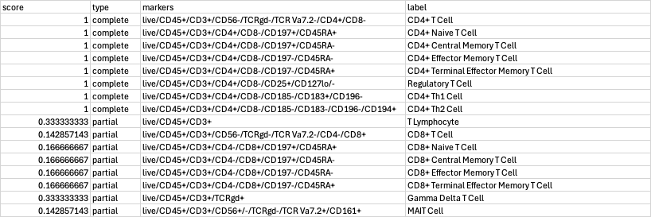
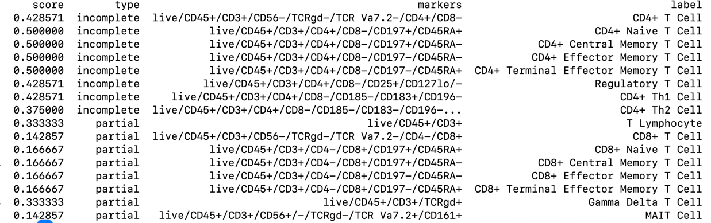

## Analysis of function 

Mapping types are confusing.  

From README.md

> The system provides three types of matches:
> 
> 1. **Complete Match**: All input markers are present in the population definition
> 2. **Partial Match**: Some input markers match, but additional markers may be present
> 3. **Broader Match**: Population is a broader category that includes the input markers

Mapping may be too liberal.

Input string: 

`CD8-;CD4+;CD3`  Note CD3 is treated as +.

=>

Complete means all specified markers match, but other markers required to => exact match.
Should this be Broad?

Partial means, only some of the specified markers match.

Note sure what would count as 'Broader'.  No examples here. Inspecting code,
it looks like this is not actually supported.  

What we really want.

1. Input exactly matches all markers in spec
2. Broad match - all input markers have matches in spec, but spec includes other markers
3. Partial match - Some input markers match the spec

### Some progress:

We now have 3 categories:

Exact, incomplete & partial 

(Not yet reflected in output)

